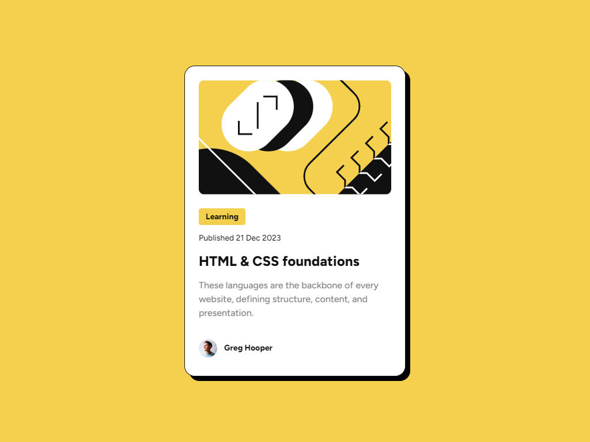

# Frontend Mentor - Blog preview card solution

This is a solution to the [Blog preview card challenge on Frontend Mentor](https://www.frontendmentor.io/challenges/blog-preview-card-ckPaj01IcS).

## Table of contents

- [Overview](#overview)
  - [The challenge](#the-challenge)
  - [Screenshot](#screenshot)
  - [Links](#links)
- [My process](#my-process)
  - [Built with](#built-with)
- [Author](#author)

## Overview

### The challenge

Users should be able to:

- See hover and focus states for all interactive elements on the page

### Screenshot

### Links

- Solution URL: [https://github.com/ferfalcon/blog-preview-card](https://github.com/ferfalcon/blog-preview-card/)
- Live Site URL: [https://ferfalcon.github.io/blog-preview-card](https://ferfalcon.github.io/blog-preview-card/)

## My process

### Built with

- Semantic HTML5 markup
- Mobile-first workflow
- CSS custom properties
- Flexbox
- CSS Grid
- [BEM](https://getbem.com/) - Naming convention for HTML elements classification
- [Less](https://lesscss.org/) - CSS preprocessor for styles

## Author

- Website - [ferfalcon.com](http://ferfalcon.com/)
- LinkedIn - [Fernando Falcon](https://www.linkedin.com/in/fernandofalcon/)
- Frontend Mentor - [@ferfalcon](https://www.frontendmentor.io/profile/ferfalcon/)
- Twitter - [@fernandofalcon](https://www.twitter.com/fernandofalcon/)